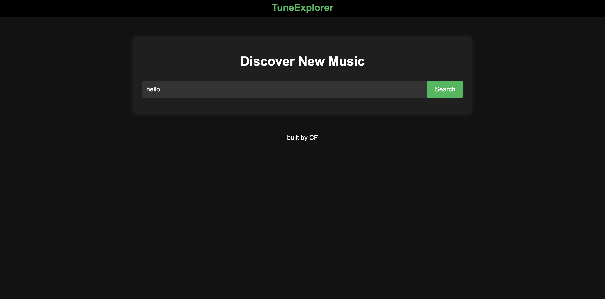
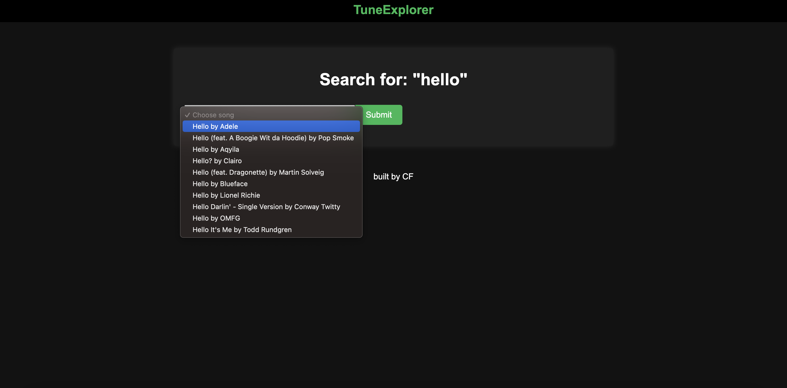
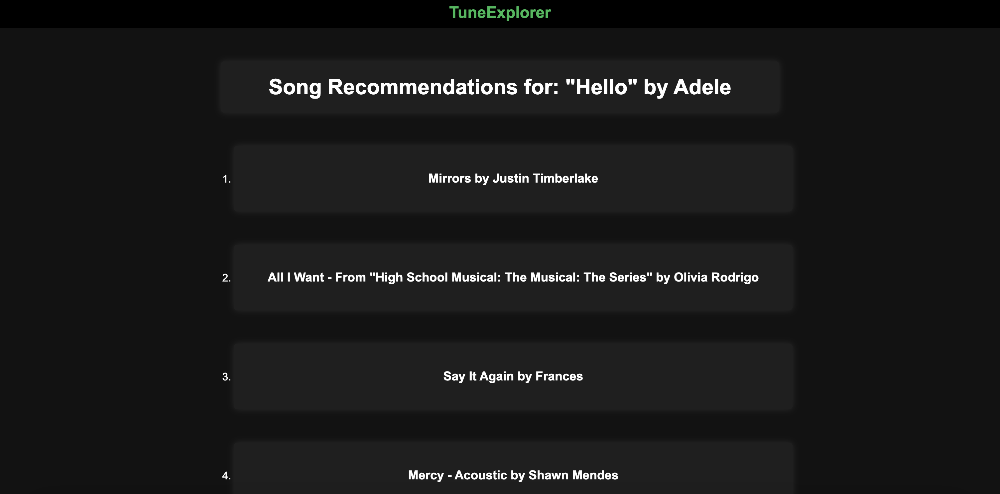

# TuneExplorer
#### Description: For this side project I built a song recommendation web application called TuneExplorer. The app takes in a single song name as input, then searches through Spotify's song database to find the song, artist, tempo, energy, and other info about the song and it's content. An algorithm then searches through the rest of the database to find songs with similar content. It will find songs with a similar tempo, energy, genre, etc. It then displays a list of found songs that the user can then use as recommendations. The idea is that the user finds a song they like input it into the web app and will get back similar songs that they will also enjoy. I also deployed the website using PythonAnywhere,
#### Link: http://tuneexplorer.pythonanywhere.com/

